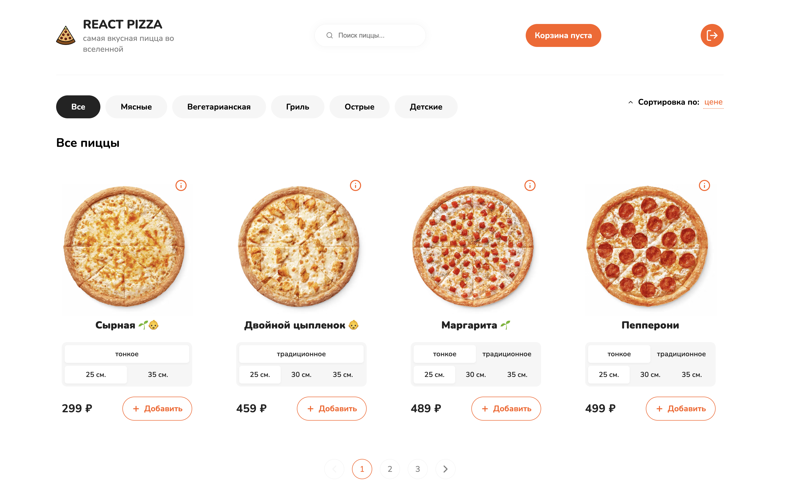
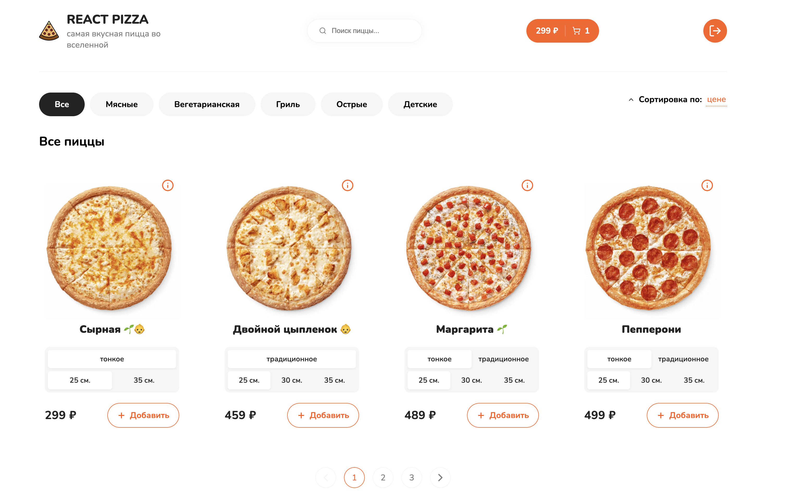
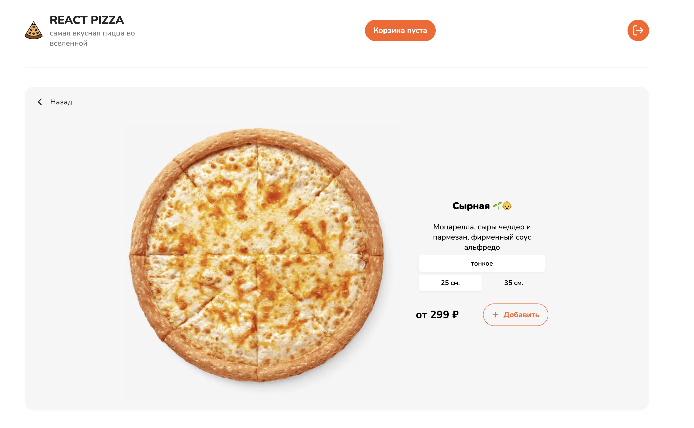
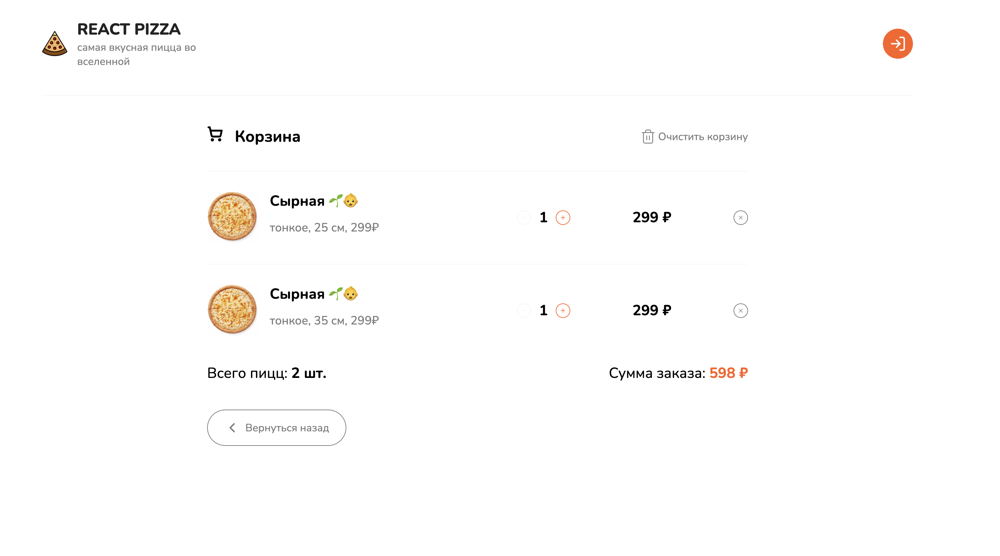
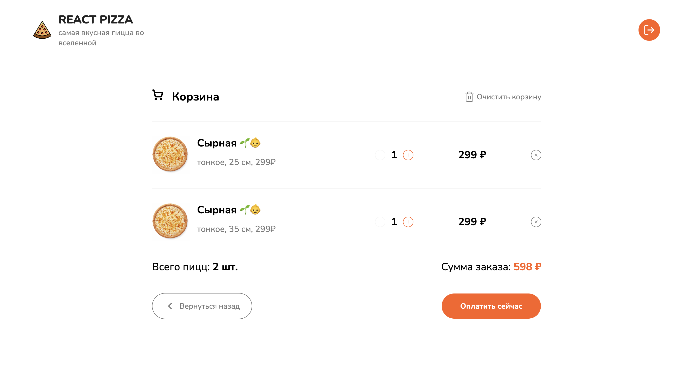
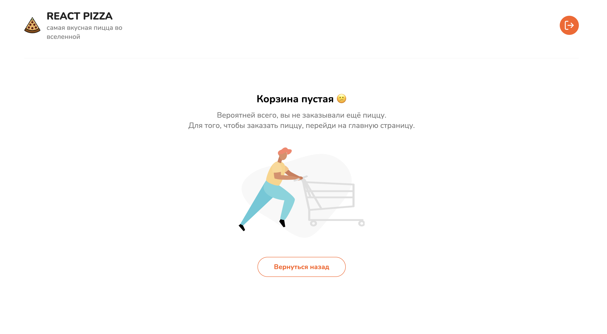

# 🍕 Проект "DODO"

Пет-проект "DODO" — это веб-приложение для заказа еды.
Посмотреть демо-проекта можно по ссылке https://tatasenochek.github.io/dodo-app/

### Описание проекта

В качестве референса использован интерфейс сайта пиццерии "Dodo Pizza". В данном проекте реализовано:

- адаптивный дизайн;
- получение товара с бэкэнда;
- фильтрация товара по категории, цене, названию, популярности;
- сортировка по возрастанию и убыванию;
- поиск товра;
- пагинация;
- возможность добавления товаров в корзину;
- изменение количества товаров в корзине;
- расчет стоимости заказа;
- возможность оформить заказ;

### Задачи выполненные на проекте

- верстка по макету;
- стилизовала с помощью SCSS-module;
- адаптировала под различные устройства;
- настроила и подключила Redux-хранилище;
- реализовала слайсы для управления состоянием;
- реализовала асинхронные запросы для взаимодействие с API;
- реализовала сохранение состояния приложения в LocalStorage;
- реализовала навигацию по сайту;
- реализовала поиск товаров, фильтрацию и сортировку товаров через параметры запросов в axios;
- оптимизировала запрос поиска товаров с помощью библиотеки useDebounce;
- реализовала пагинацию на странице товаров;
- реализовала лоадер с помощью скелетона;
- реализовала расчет стоимости заказа;
- реализовала добавление товаров в зависимости от разных параметров пиццы;
- написала юнит-тесты с использованием Jest;

### Технологии

- React
- TypeScript
- Redux Toolkit (createSlice, createAsyncThunk, extraReducers)
- React Router
- Axios
- MockAPI
- SCSS Modules
- Jest
- Vite
- GitHub Actions

### Установка и запуск

Для установки и запуска проекта необходимо выполнить команды

npm install
npm run start
npm run build

или

yarn
yarn start
yarn build

### Тестирование

Состояния и асихронные запросы приложения покрыты юнит-тестами Jest. Для их запуска выполните команду:

npm run test

### Скриншоты приложения

Здесь представлены некоторые скриншоты интерфейса приложения:

